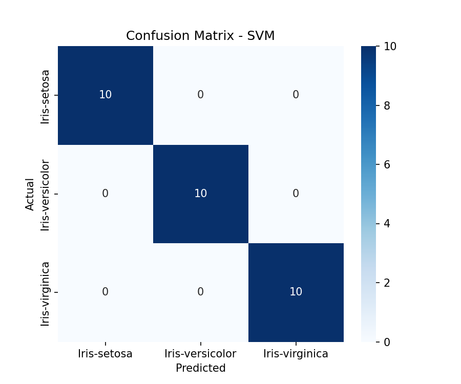
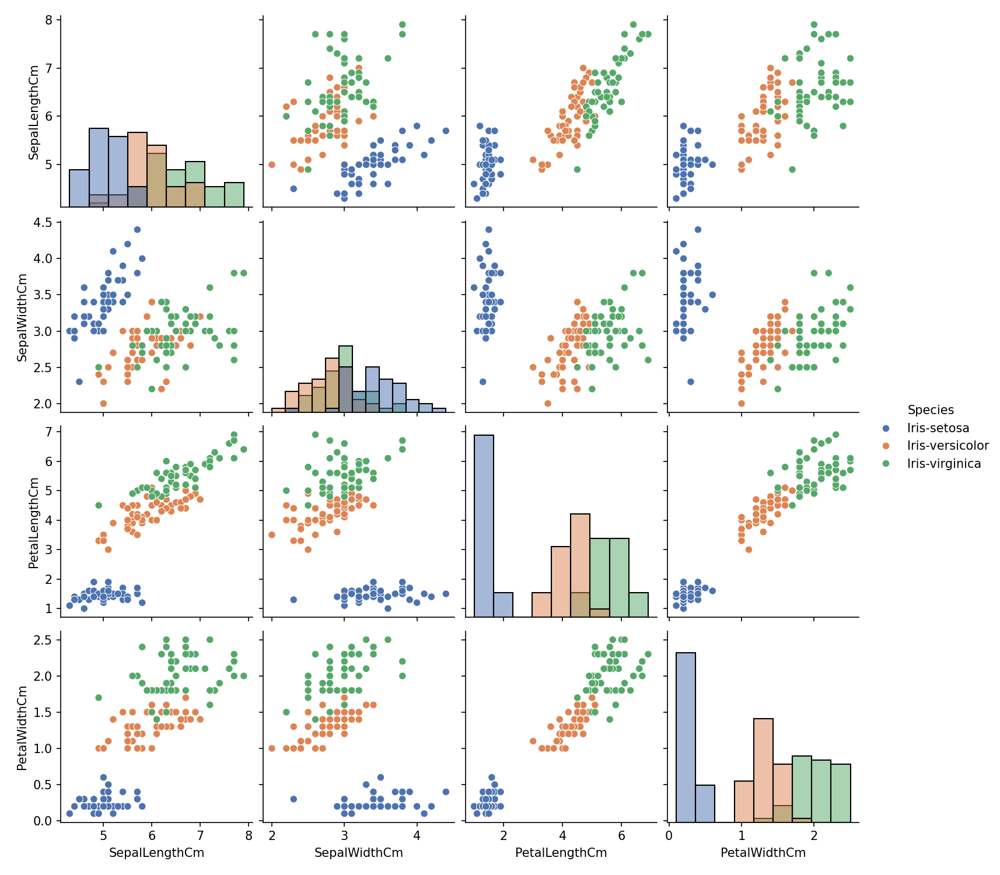

# Iris Flower Classification 🌸

A machine learning project that classifies Iris flowers into one of three species — **Setosa**, **Versicolor**, or **Virginica** — based on four physical measurements. Built as a foundational, end-to-end classification project: data loading, exploratory analysis, preprocessing, model comparison, evaluation, and prediction.


## Problem Statement

Given a flower's sepal length, sepal width, petal length, and petal width, can a model reliably predict which of three Iris species it belongs to? This is a classic multi-class classification problem, used here to demonstrate core ML fundamentals — train/test splitting, feature scaling, model comparison, and evaluation metrics.

## Dataset

- **Source:** [Iris.csv on Kaggle](https://www.kaggle.com/datasets/saurabh00007/iriscsv) by saurabh00007
- **Samples:** 150 (50 per species, perfectly balanced)
- **Features:** `SepalLengthCm`, `SepalWidthCm`, `PetalLengthCm`, `PetalWidthCm`
- **Target:** `Species` (`Iris-setosa`, `Iris-versicolor`, `Iris-virginica`)
- **Missing values:** None

## Approach

1. **Load** the dataset and drop the non-predictive `Id` column.
2. **Explore (EDA):** summary statistics, pairplot, boxplots, and a correlation heatmap — petal measurements separate the species far more clearly than sepal measurements.
3. **Preprocess:** encode species labels to integers (`LabelEncoder`), split into train/test sets (80/20, stratified), and scale features (`StandardScaler`, fit on train only).
4. **Train & compare** four classifiers: Logistic Regression, K-Nearest Neighbors, Decision Tree, and SVM.
5. **Evaluate** the best model using accuracy, a classification report (precision/recall/F1), and a confusion matrix.
6. **Save** the trained model, scaler, and label encoder so predictions can be made later without retraining.
7. **Predict** on new flower measurements using the saved artifacts.

## Results

| Model | Test Accuracy |
|---|---|
| Logistic Regression | ~0.93 |
| K-Nearest Neighbors | ~0.93 |
| Decision Tree | ~0.93 |
| **SVM (best)** | **~1.00** |

*(Exact numbers can vary slightly depending on the random train/test split seed.)*

**Confusion Matrix (best model):**



**Feature relationships by species:**



> Note: Iris is a small, well-separated dataset, so near-perfect accuracy is expected here — this project demonstrates a clean end-to-end ML workflow rather than performance on a hard, real-world problem.

## Project Structure

```
iris-flower-classification/
|-- README.md
|-- requirements.txt
|-- .gitignore
|
|-- data/
|   `-- Iris.csv
|
|-- notebooks/
|   `-- iris_classification.ipynb
|
|-- src/
|   `-- predict.py
|
|-- models/
|   |-- iris_model.pkl
|   |-- scaler.pkl
|   `-- label_encoder.pkl
|
`-- images/
    |-- pairplot.png
    `-- confusion_matrix.png
```

## How to Run

Clone the repo and install dependencies:

```bash
git clone https://github.com/hrithika2005119/Iris-Flower-Classification.git
cd Iris-Flower-Classification
pip install -r requirements.txt
```

Run a prediction using the already-trained model:

```bash
python src/predict.py
```

Or open `notebooks/iris_classification.ipynb` in Jupyter/Colab to see the full workflow — data loading through training and evaluation.

## Tech Stack

- **Language:** Python 3
- **Data handling:** pandas, numpy
- **Visualization:** matplotlib, seaborn
- **ML modeling:** scikit-learn
- **Model persistence:** joblib
- **Development:** Google Colab (exploration & training) → VS Code (packaging & GitHub)

## Future Improvements

- Deploy as an interactive Streamlit or Flask app
- Add hyperparameter tuning with `GridSearchCV`
- Add a REST API endpoint for predictions
- Add more `src/` scripts (`train.py`, `evaluate.py`) for a fully modular pipeline

## Author

Hrithika
